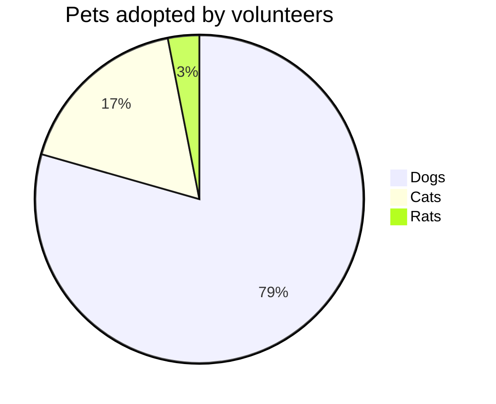

# DO NOT DELETE
## Test project

# BCPT
|Suite|Codeunit ID|Codeunit Name|Operation|Duration|SQL Stmts|
|:---|:---|:---|:---|:--:|---:|
|10USERTEST|60003|BCPT Create PO with N Lines|Enter Line Quantity|**7,43**|**6**|
||||Add Order|**75,43**|**11**|
||||Scenario|**769,21**|**220**|
||||Enter Line Item No.|**6,29**|**3**|
||||Enter Account No.|**75,36**|**10**|
||60007|BCPT Detail Trial Bal. Report|Scenario|**4.710,77**|**10**|
||60004|BCPT Create SO with N Lines|Enter Line Quantity|**11,92**|**12**|
||||Add Order|**18,77**|**10**|
||||Scenario|**405,31**|**290**|
||||Enter Line Item No.|**10,77**|**7**|
||||Enter Account No.|**19,85**|**11**|
||60005|BCPT Create SQ with N Lines|Enter Line Quantity|**15,71**|**12**|
||||Add Order|**22,59**|**9**|
||||Scenario|**454,41**|**237**|
||||Enter Line Item No.|**6,53**|**4**|
||||Enter Account No.|**27,71**|**12**|

> No baseline provided. Copy a set of BCPT results to $baseLinePath in order to establish a baseline.

| Name | Required | Description | Default value |
| :-- | :-: | :-- | :-- |
| shell | | The shell (powershell or pwsh) in which the PowerShell script in this action should run | powershell |
| actor | | The GitHub actor running the action | github.actor |
| token | - [x] | The GitHub token running the action | github.token |
| parentTelemetryScopeJson | | Specifies the parent telemetry scope for the telemetry signal | {} |
| project | :white_check_mark: | Name of project to analyze or . if the repository is setup for single project | |

Test5
Test7

