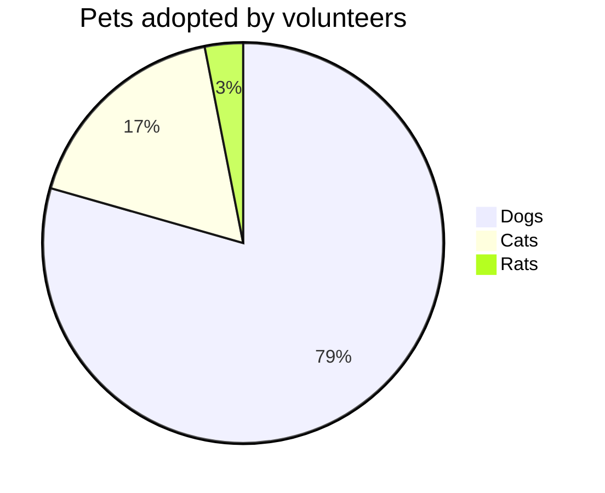

# DO NOT DELETE
## Test project

# BCPT
|Suite|Codeunit ID|Codeunit Name|Operation|Status|Duration|Duration (BaseLine)|SQL Stmts|SQL Stmts (BaseLine)|
|:---|:--:|:---|:---|:--:|---:|---:|---:|---:|
|10USERTEST|60003|BCPT Create PO with N Lines|Enter Line Quantity|:heavy_check_mark:|7,43|**7,31**|**6**|6|
||||Add Order|:x:|75,43|**10,46**|11|**9**|
||||Scenario|:x:|769,21|**337,46**|220|**211**|
||||Enter Line Item No.|:heavy_check_mark:|6,29|**6,23**|**3**|3|
||||Enter Account No.|:x:|75,36|**11,15**|10|**8**|
||60007|BCPT Detail Trial Bal. Report|Scenario|:x:|4.710,77|**4.430,05**|10|**5**|
||60004|BCPT Create SO with N Lines|Enter Line Quantity|:heavy_check_mark:|11,92|**11,58**|**12**|12|
||||Add Order|:x:|18,77|**15,92**|**10**|10|
||||Scenario|:warning:|405,31|**381,33**|290|**282**|
||||Enter Line Item No.|:x:|10,77|**8,17**|7|**7**|
||||Enter Account No.|:x:|19,85|**17,58**|11|**11**|
||60005|BCPT Create SQ with N Lines|Enter Line Quantity|:warning:|15,71|**14,88**|**12**|12|
||||Add Order|:x:|22,59|**10,56**|9|**8**|
||||Scenario|:x:|454,41|**366,12**|237|**231**|
||||Enter Line Item No.|:heavy_check_mark:|6,53|**6,50**|**4**|4|
||||Enter Account No.|:x:|27,71|**15,12**|12|**10**|
