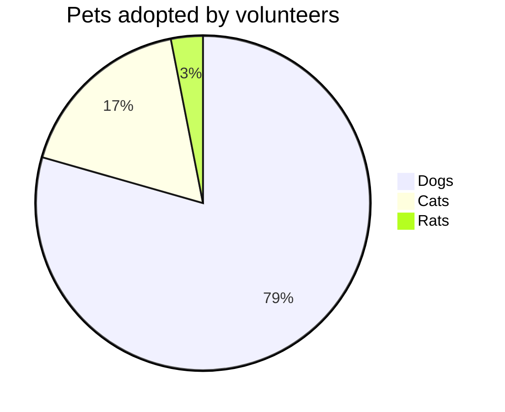

# DO NOT DELETE
## Test project

# BCPT
|Suite|Codeunit ID|Codeunit Name|Operation|Status|Duration|Duration (BaseLine)|SQL Stmts|SQL Stmts (BaseLine)|
|:---|:---|:---|:---|:--:|---:|---:|---:|---:|
|10USERTEST|60003|BCPT Create PO with N Lines|Enter Line Quantity|:heavy_check_mark:|7,31|7,31|6|6|
||||Add Order|:heavy_check_mark:|10,46|10,46|9|9|
||||Scenario|:heavy_check_mark:|337,46|337,46|211|211|
||||Enter Line Item No.|:heavy_check_mark:|6,23|6,23|3|3|
||||Enter Account No.|:heavy_check_mark:|11,15|11,15|8|8|
||60007|BCPT Detail Trial Bal. Report|Scenario|:heavy_check_mark:|4.430,05|4.430,05|5|5|
||60004|BCPT Create SO with N Lines|Enter Line Quantity|:heavy_check_mark:|11,58|11,58|12|12|
||||Add Order|:heavy_check_mark:|15,92|15,92|10|10|
||||Scenario|:heavy_check_mark:|381,33|381,33|282|282|
||||Enter Line Item No.|:heavy_check_mark:|8,17|8,17|7|7|
||||Enter Account No.|:heavy_check_mark:|17,58|17,58|11|11|
||60005|BCPT Create SQ with N Lines|Enter Line Quantity|:heavy_check_mark:|14,88|14,88|12|12|
||||Add Order|:heavy_check_mark:|10,56|10,56|8|8|
||||Scenario|:heavy_check_mark:|366,12|366,12|231|231|
||||Enter Line Item No.|:heavy_check_mark:|6,50|6,50|4|4|
||||Enter Account No.|:heavy_check_mark:|15,12|15,12|10|10|

