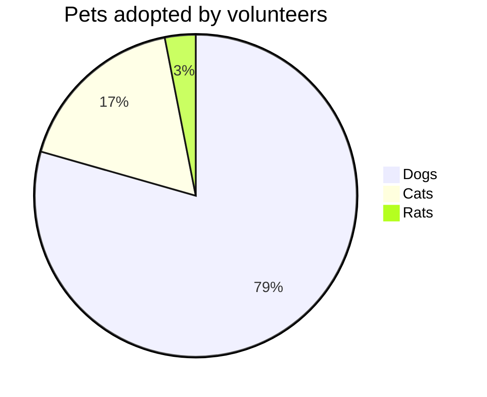

# DO NOT DELETE
## Test project

|Suite|Codeunit ID|Codeunit Name|Operation|Status|Duration|SQL Stmts|
|:---|:---|:---|:---|:--:|---:|---:|
|10USERTEST|60003|BCPT Create PO with N Lines|Enter Line Quantity|:x:|7,31|6|
||||Add Order|:x:|10,46|9|
||||Scenario|:x:|337,46|211|
||||Enter Line Item No.|✔️:|6,23|3|
||||Enter Account No.|:x:|11,15|8|
||60007|BCPT Detail Trial Bal. Report|Scenario|:x:|4.430,05|5|
||60004|BCPT Create SO with N Lines|Enter Line Quantity|:x:|11,58|12|
||||Add Order|:x:|15,92|10|
||||Scenario|:warning:|381,33|282|
||||Enter Line Item No.|:x:|8,17|7|
||||Enter Account No.|:x:|17,58|11|
||60005|BCPT Create SQ with N Lines|Enter Line Quantity|:x:|14,88|12|
||||Add Order|:x:|10,56|8|
||||Scenario|:x:|366,12|231|
||||Enter Line Item No.|:x:|6,50|4|
||||Enter Account No.|:x:|15,12|10|

