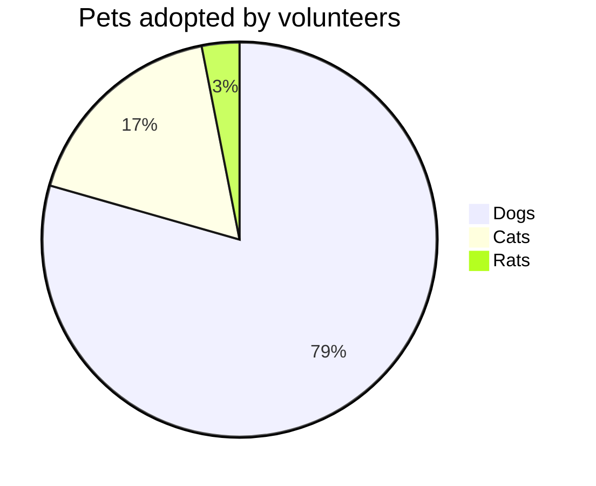

# DO NOT DELETE
## Test project

# BCPT
|BCPT Suite|Codeunit ID|Codeunit Name|Operation|Status|Duration (ms)|Duration base (ms)|Duration diff (ms)|SQL Stmts|SQL Stmts base|SQL Stmts diff|
|:---------|:----------|:------------|:--------|:----:|------------:|-----------------:|-----------------:|--------:|-------------:|-------------:|
|10USERTEST|60003|BCPT Create PO with N Lines|Scenario|:heavy_check_mark:|276.00|368.00|-92.00|211|211|0|
||||Enter Account No.|:heavy_check_mark:|8.00|9.00|-1.00|8|8|0|
||||Enter Line Item No.|:heavy_check_mark:|5.00|8.00|-3.00|3|3|0|
||||Add Order|:heavy_check_mark:|7.00|7.00|0.00|9|9|0|
||||Enter Line Quantity|:heavy_check_mark:|7.00|9.00|-2.00|6|6|0|
||60007|BCPT Detail Trial Bal. Report|Scenario|:heavy_check_mark:|4,570.00|7,007.00|-2,437.00|5|5|0|
||60005|BCPT Create SQ with N Lines|Scenario|:heavy_check_mark:|307.00|338.00|-31.00|230|230|0|
||||Enter Account No.|:heavy_check_mark:|11.00|12.00|-1.00|10|10|0|
||||Enter Line Item No.|:heavy_check_mark:|6.00|7.00|-1.00|4|4|0|
||||Add Order|:heavy_check_mark:|6.00|7.00|-1.00|8|8|0|
||||Enter Line Quantity|:heavy_check_mark:|14.00|17.00|-3.00|12|12|0|
||60004|BCPT Create SO with N Lines|Scenario|:heavy_check_mark:|296.00|409.00|-113.00|281|281|0|
||||Enter Account No.|:heavy_check_mark:|11.00|13.00|-2.00|11|11|0|
||||Enter Line Item No.|:heavy_check_mark:|7.00|10.00|-3.00|7|7|0|
||||Add Order|:heavy_check_mark:|10.00|10.00|0.00|9|9|0|
||||Enter Line Quantity|:heavy_check_mark:|11.00|14.00|-3.00|12|12|0|

| Name | Required | Description | Default value |
| :-- | :-: | :-- | :-- |
| shell | | The shell (powershell or pwsh) in which the PowerShell script in this action should run | powershell |
| actor | | The GitHub actor running the action | github.actor |
| token | - [x] | The GitHub token running the action | github.token |
| parentTelemetryScopeJson | | Specifies the parent telemetry scope for the telemetry signal | {} |
| project | :white_check_mark: | Name of project to analyze or . if the repository is setup for single project | |

Test5
Test7

